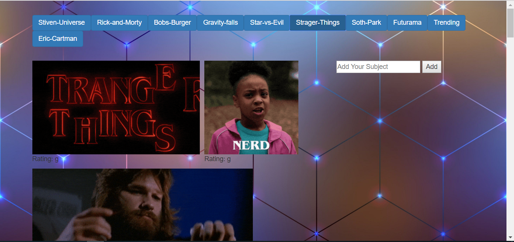

# GifTastic

In this assignment we were taskd with using the GIPHY API to make a dynamic web page that populates with gifs of the users choice.

https://danoliveira901.github.io/GifTastic/

# Built With
* Giphy API
* Javascript
* JQuery
* Html 5
* Css
* Ajax

